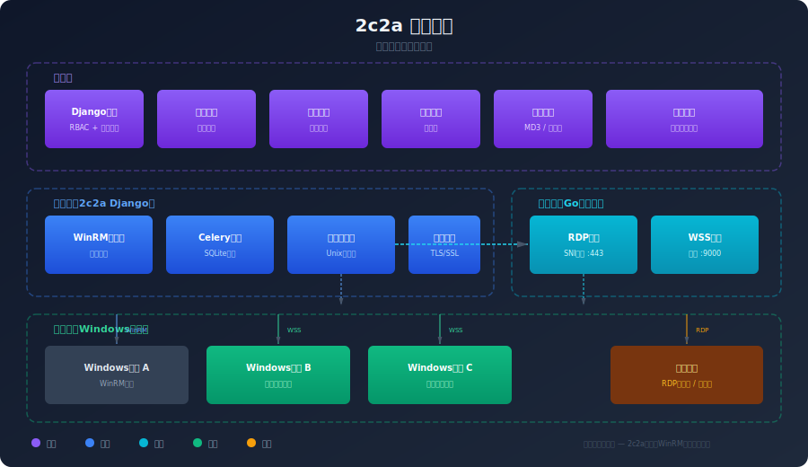

<div align="center">


<h1>2c2a - Zero Agent Security Control Architecture</h1>

<p>
  <strong>基于 Django 的企业级 Windows 主机远程管理平台</strong><br>
  零代理架构 · WinRM 直连 · Gateway 隧道保护 · 可选部署
</p>

<p>
  
  
  
  
</p>

</div>

---

## 核心特性


- **零代理架构**：无需在目标主机安装客户端软件，通过 WinRM 协议直接管控
- **Gateway 隧道保护**：可选部署 Gateway，为零公网 IP 主机提供安全 RDP 访问
- **Django Admin 优先**：最大化利用 Django 内置管理功能，降低学习成本
- **Material Design 3**：现代化的前端用户体验，支持多主题切换
- **RBAC 权限控制**：细粒度的角色和权限管理，满足企业合规要求
- **安全审计**：完整的操作日志和安全监控，支持行为分析
- **松耦合设计**：Gateway 为可选组件，2c2a 可独立运行

## 系统架构



2c2a 采用四层架构设计：

| 层级 | 组件 | 说明 |
|------|------|------|
| **管理层** | Django Admin | RBAC、审计、工单、插件、主题、主机保护配置 |
| **核心层** | 2c2a Django | WinRM 客户端、Celery 任务、GatewayClient、证书管理 |
| **网关层** | Gateway (Go) | RDP 代理 (SNI 路由)、WSS 隧道服务、控制面 (可选) |
| **边缘层** | 2c2a-tunnel (Go) | Windows 服务、WSS 客户端、多路复用、远程执行 |

> **Gateway 为可选组件**：不部署 Gateway 时，2c2a 通过 WinRM 直连管理主机，功能完全可用。部署 Gateway 后可启用主机保护模式，实现零公网 IP 的安全 RDP 访问。

## 生态项目

| 项目 | 语言 | 说明 |
|------|------|------|
| [2c2a](.) | Python/Django | 核心管理平台，Web 后台 + API |
| [Gateway](../gateway) | Go | 隧道网关，RDP 代理 + WSS 服务 + 控制面 |
| [Tunnel](../tunnel) | Go | 边缘代理，Windows 服务 + WSS 客户端 |

## 快速开始


### 环境要求

- Python 3.13+（由 `.python-version` 文件指定）
- PostgreSQL 12+（可选，也可使用 SQLite）
- Go 1.22+（仅 Gateway/Tunnel 开发需要）

### 环境配置

1. **复制环境配置文件**

```bash
cp .env.example .env
```

2. **编辑 .env 文件**

```bash
nano .env
```

3. **关键配置项说明**

```bash
DEBUG=True
SECRET_KEY=your-secret-key-here

# 数据库配置 (PostgreSQL)
DB_HOST=localhost
DB_PORT=5432
DB_NAME=2c2a_dev
DB_USER=2c2a_user
DB_PASSWORD=your_password

# Gateway (可选)
GATEWAY_ENABLED=False
GATEWAY_CONTROL_SOCKET=/run/2c2a/control.sock

# 演示模式 (快速体验)
2C2A_DEMO=1
```

### 开发环境搭建

```bash
git clone https://github.com/2c2a/2c2a.git
cd 2c2a

uv sync
uv run python manage.py migrate
uv run python manage.py createsuperuser
uv run python manage.py runserver
```

访问 `http://127.0.0.1:8000/admin/` 进入管理后台。

### 启用 Gateway（可选）

```bash
# 1. 构建并启动 Gateway
cd ../gateway
go build -o 2c2a-gateway ./cmd/gateway/
./2c2a-gateway -config configs/gateway.yaml

# 2. 在 2c2a .env 中启用
GATEWAY_ENABLED=True

# 3. 启动事件监听
uv run python manage.py gateway_listener

# 4. 为主机生成 Tunnel Token
uv run python manage.py generate_tunnel_token <host_id>
```

### 部署 Tunnel 到 Windows 主机

```bash
# 下载 2c2a-tunnel.exe (从 GitHub Release)
# 或通过 CI/CD 自动打包

2c2a-tunnel.exe install \
  -token <TOKEN> \
  -server wss://gateway.example.com:9000
```

> **注意**：本项目使用 [UV](https://github.com/astral-sh/uv) 作为 Python 包管理器。所有 Python 命令都必须通过 `uv run` 执行。

## 项目结构

```
2c2a/
├── apps/                 # 应用模块
│   ├── accounts/        # 用户认证
│   ├── hosts/          # 主机管理 + 隧道连接
│   ├── operations/     # 运维操作 + RDP域名路由
│   ├── audit/          # 审计日志 + 隧道事件
│   ├── dashboard/      # 仪表盘
│   ├── bootstrap/      # 安全启动
│   ├── certificates/   # 证书管理
│   ├── plugins/        # 插件系统
│   └── themes/         # 主题管理
├── config/             # 项目配置
├── utils/              # 工具模块
│   ├── gateway_client.py  # Gateway客户端(松耦合)
│   ├── winrm_client.py    # WinRM客户端
│   └── ...
├── docs/               # 技术文档
├── frontend/           # 前端静态文件和模板
└── pyproject.toml      # 项目依赖 (UV, 无Redis)
```

## 文档目录

详细的项目文档请查看 [`docs/`](./docs) 目录：

- [开发规范指南](./docs/00_开发规范指南.md) - 强制执行的开发标准
- [项目架构与设计](./docs/01_项目架构与设计.md) - 系统架构和技术选型
- [API接口文档](./docs/02_API接口文档.md) - RESTful API 详细说明
- [Database Schema](./docs/03_Database_Schema.md) - 数据库设计和表结构
- [部署运维手册](./docs/04_部署运维手册.md) - 生产环境部署指南
- [更新日志](./docs/05_更新日志.md) - 版本发布历史
- [安全配置指南](./docs/06_安全配置指南.md) - 安全策略和防护措施

## 安全特性

- 基于角色的访问控制 (RBAC)
- 数据传输加密 (TLS/SSL)
- 敏感信息加密存储
- 完整的操作审计日志（含隧道/RDP事件）
- 多因素认证支持
- 防暴力破解机制
- 安全启动和会话管理
- 主机保护模式（Gateway 隧道隔离）
- Ed25519 密钥交换

## 贡献指南

我们欢迎任何形式的贡献！请先阅读我们的[开发规范指南](./docs/00_开发规范指南.md)。

### 分支规范（分阶段发布模型）

本项目采用 **5 级分阶段分支模型**，所有生态仓库（包括 [webServer](https://github.com/2c2a/webServer)）统一遵循：

| 分支 | 阶段 | 用途 | 部署环境 |
|------|------|------|----------|
| `master` | 生产版本 | 线上稳定运行，仅接受 hotfix 合并 | 生产服务器 |
| `beta` | 公测版本 | 服务器端集成测试，QA 验证通过后方可合入 master | 预发布/测试服务器 |
| `alpha` | 内测版本 | 本地开发机测试，功能验证与联调 | 本地开发环境 |
| `hotfix` | 热修补 | 紧急修复线上问题，从 master 切出，修复后合并回 master 并同步 beta/alpha | 临时生产修复 |
| `feat` | 功能开发 | 新功能迭代分支，开发完成后合并至 alpha 进入内测 | 本地开发环境 |

**合并流向**：`feat` → `alpha` → `beta` → `master`，`hotfix` 可直接回灌各分支。

### 开发流程

1. Fork 项目
2. 从 `feat` 切出功能子分支 (`git checkout -b feat/xxx origin/feat`)
3. 开发完成后合并至 `alpha` 进行本地测试
4. 通过测试后提 PR 合并至 `beta` 进行服务器公测
5. QA 通过后由维护者合并至 `master` 发布

## 许可证

本项目采用 AGPL-3.0 许可证 - 查看 [LICENSE](LICENSE) 文件了解详情。

## 联系我们

- 组织主页: https://github.com/2c2a
- 2c2a 仓库: https://github.com/2c2a/2c2a
- 问题反馈: [GitHub Issues](https://github.com/2c2a/2c2a/issues)

---

<div align="center">

*2c2a - 让 Windows 主机管理更简单、更安全*

</div>
