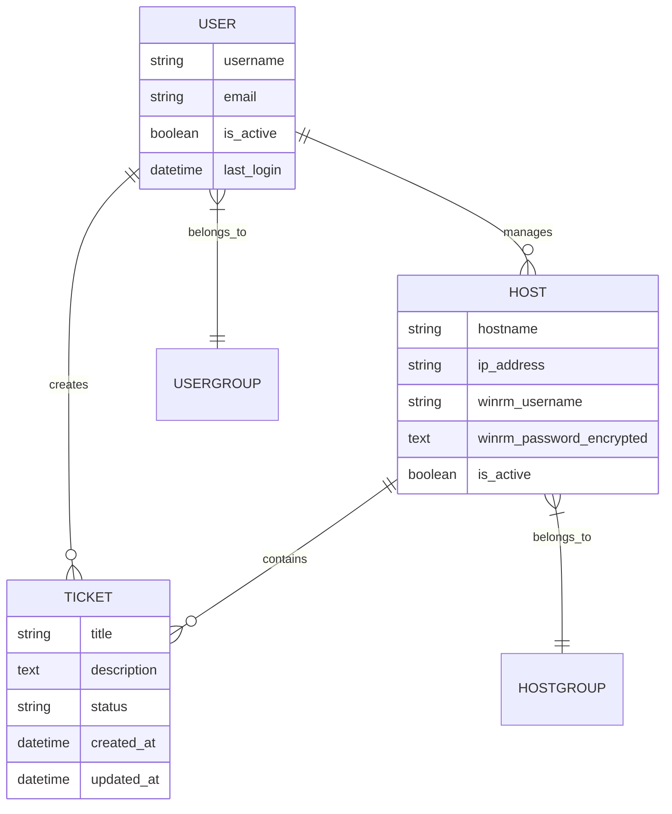

# ZASCA 项目架构与设计文档

## 1. 项目概述

ZASCA（Zero Agent Security Control Architecture）是一个基于 Django 的零代理安全管控平台，专注于 Windows 主机的远程管理和权限控制。

### 1.1 核心特性
- **零代理架构**：无需在目标主机安装客户端软件
- **基于 WinRM 协议**：利用 Windows 原生远程管理协议
- **RBAC 权限控制**：细粒度的角色和权限管理
- **Django Admin 优先**：最大化利用 Django 内置管理功能
- **Material Design 3**：现代化的前端用户体验

### 1.2 技术栈选择理由

#### 后端框架：Django 4.x
- **成熟稳定**：经过生产环境验证的企业级框架
- **内置 Admin**：强大的后台管理系统，减少开发工作量
- **安全性**：内置 CSRF、XSS 等安全防护机制
- **ORM 优势**：数据库操作简洁，易于维护

#### 前端规范：Material Design 3
- **设计一致性**：Google 设计语言，用户体验统一
- **响应式友好**：天然适配各种设备屏幕
- **组件丰富**：成熟的组件库可供参考实现

## 2. 系统架构图

```
┌─────────────────┐    ┌─────────────────┐    ┌─────────────────┐
│   用户浏览器     │    │   Nginx/反向代理 │    │   Django 应用    │
│  (Material MD3)  │◄──►│    (负载均衡)    │◄──►│   (核心业务逻辑)  │
└─────────────────┘    └─────────────────┘    └─────────────────┘
                                                              │
                    ┌─────────────────┐    ┌─────────────────┐│
                    │   PostgreSQL    │    │   Redis 缓存     ││
                    │   (主数据库)     │    │   (会话/缓存)    ││
                    └─────────────────┘    └─────────────────┘│
                                                              │
                    ┌─────────────────┐                      │
                    │ Windows 主机     │◄─────────────────────┘
                    │ (WinRM 远程)     │
                    └─────────────────┘
```

## 3. 应用模块划分

### 3.1 核心应用模块

```
apps/
├── accounts/          # 用户认证与权限管理
├── hosts/            # 主机管理与连接配置
├── operations/       # 运维操作与工单系统
├── audit/            # 审计日志与安全监控
├── dashboard/        # 系统仪表盘与统计
├── tasks/            # 异步任务管理
├── certificates/     # 证书管理
└── bootstrap/        # 初始化配置
```

### 3.2 插件系统

```
plugins/
├── core/             # 插件核心框架
├── management/       # 插件管理命令
└── sample_plugins/   # 示例插件
```

### 3.3 工具模块

```
utils/
├── winrm_client.py   # WinRM 客户端封装
├── helpers.py        # 通用辅助函数
└── local_winserver_client.py  # 本地 Windows 服务客户端
```

## 4. 数据模型设计

### 4.1 核心实体关系



### 4.2 权限模型

采用基于角色的访问控制（RBAC）：
- **超级管理员**：系统全局管理权限
- **主机管理员**：特定主机组的管理权限
- **普通用户**：受限的操作权限
- **审计员**：只读查看权限

## 5. 安全架构

### 5.1 认证机制
- Django 内置认证系统
- Session + Cookie 管理
- 可扩展的第三方认证集成

### 5.2 授权控制
- 基于 Django Permission 系统
- 对象级别的权限控制
- 产品维度的数据隔离

### 5.3 数据保护
- 敏感信息加密存储
- WinRM 凭证 AES 加密
- 数据库连接 SSL 加密

### 5.4 审计追踪
- 所有关键操作记录日志
- 用户行为审计
- 系统安全事件监控

## 6. 部署架构

### 6.1 生产环境推荐配置

```
Load Balancer (Nginx) 
    ├── Web Server 1 (Gunicorn)
    ├── Web Server 2 (Gunicorn)
    └── Web Server N (Gunicorn)
    
Database (PostgreSQL Master-Slave)
Cache (Redis Cluster)
Message Queue (Celery + Redis)
```

### 6.2 环境变量配置

```bash
# 基础配置
DEBUG=False
SECRET_KEY=your-secret-key
ALLOWED_HOSTS=your-domain.com

# 数据库配置
DB_HOST=localhost
DB_PORT=5432
DB_NAME=zasca_prod
DB_USER=zasca_user
DB_PASSWORD=secure_password

# Redis 配置
REDIS_URL=redis://localhost:6379/0

# 安全配置
SECURE_SSL_REDIRECT=True
SESSION_COOKIE_SECURE=True
CSRF_COOKIE_SECURE=True
```

## 7. 性能优化策略

### 7.1 数据库优化
- 合理的索引设计
- 查询集优化
- 连接池配置

### 7.2 缓存策略
- 页面级缓存
- 数据查询缓存
- 会话缓存

### 7.3 异步处理
- Celery 任务队列
- 异步 WinRM 操作
- 批量处理优化

## 8. 监控与运维

### 8.1 系统监控指标
- 应用性能指标（APM）
- 数据库性能监控
- 系统资源使用率

### 8.2 日志管理
- 结构化日志输出
- 日志级别分类
- 日志轮转策略

### 8.3 告警机制
- 关键业务指标告警
- 系统异常自动通知
- 性能阈值监控

## 9. 扩展性设计

### 9.1 插件化架构
- 标准化插件接口
- 动态加载机制
- 插件生命周期管理

### 9.2 微服务准备
- 业务边界清晰划分
- API 接口标准化
- 数据库读写分离

## 10. 技术决策依据

### 10.1 选择 Django Admin 的原因
1. **开发效率**：大幅减少后台管理界面开发时间
2. **维护成本**：统一的管理界面，降低维护复杂度
3. **安全性**：经过充分测试的安全机制
4. **可扩展性**：支持自定义和扩展

### 10.2 采用 Material Design 3 的考量
1. **用户体验**：现代化、直观的交互设计
2. **一致性**：统一的设计语言提升产品专业度
3. **适应性**：良好的响应式设计支持
4. **生态成熟**：丰富的设计资源和最佳实践

---
*文档版本：V1.0*  
*最后更新：2026年2月3日*