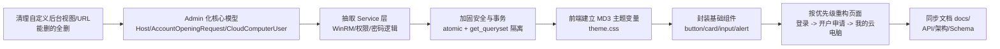

# ZASCA 前后端代码重构任务书（Phase 2）

**目标：**
- 后端：把管理员后台从"自定义视图 + 重复逻辑"全面迁移到"Django Admin + Service 层"，彻底杜绝后台乱造轮子。
- 前端：在用户前台统一使用 Material Design 3 风格，组件化、可复用，样式统一，不再和 Bootstrap 5 混用。
- 原则：安全、稳定、简单、少就是多，不新增技术债务，能删的就删。

---

## 一、总体原则（先对齐，再动手）

1. 管理员后台：能 Django Admin 做的，就绝对不要再写自定义 View。只在这几种情况下才考虑"自定义视图"：
   - 流程是高度向导式、分步骤的复杂业务向导，Admin 表单很难表达。
   - 需要高度定制化可视化展示（拓扑图、大屏等），Admin 不适合。
   - 除此之外：列表、详情、审核、批量操作，全部走 Django Admin。

2. 业务逻辑：所有真正"干事情"的代码（WinRM 调用、用户创建、密码生成、权限分配）禁止写在 `admin.py` / `views.py` 里，统一下沉到 `apps/*/services.py` 中，保持 Admin / View 非常薄。

3. 前端：用户前台允许"造轮子"，但要符合 Material Design 3 规范，所有颜色、圆角、阴影等通过 CSS 变量管理，禁止在页面中硬编码颜色。可参考 Material Components Web 的 MD3 指南实践一套基础组件。

4. 文档与代码同步：每次改动后，及时更新 `docs/` 下对应文档（API、架构、DB Schema），保持"单一事实来源"。

---

## 二、后端重构：从自定义后台 → Django Admin 优先

### 2.1 哪些模型要重构（核心范围）

依据现有 README，重点聚焦这几个核心模型：
- Host（主机）
- AccountOpeningRequest（开户申请）
- CloudComputerUser（云电脑用户）
- 如有其它"管理员后台管理对象"模型，一并纳入。

### 2.2 Step 1：Admin 化重构（管理员后台优先）

**任务：**
- 将这些模型全部用 Django Admin 注册（如果还没有）。
- 把现有的"自定义列表页 / 详情页 / 审核页面 / 操作页面"能删的都删，能用 Admin 替代的都替换。

**具体要求：**

1. 列表页用 Admin，不再手写表格：
   - 用 `list_display` 展示关键字段（主机名、IP、申请状态、申请人等）。
   - 用 `list_filter` 做维度过滤（按状态、按产品、按主机）。
   - 用 `search_fields` 提供关键字搜索（按用户名、邮箱、主机名等）。
   - 用 `date_hierarchy` 做时间维度浏览（适用于有 `created_at` 的模型）。

2. 审核类操作用 Admin Action + 自定义按钮，不再写独立 View：
   - 为 `AccountOpeningRequest` 实现 Admin Action：
     - `批准所选申请`（批量）
     - `拒绝所选申请`（批量）
   - 为单条记录增加自定义按钮（通过覆盖 `change_form_template` + 注入 JS 实现）：
     - 在详情页增加"执行开户 / 重新执行开户"按钮，不要单独写 `/operations/account-openings/<id>/process/` 的视图去处理（除非特别复杂）。

3. 关联数据用 Inline，不在详情页手写子表：
   - 在 Host 的 Admin 中，通过 Inline 展示该主机下的 CloudComputerUser（至少只读展示），让管理员在一个页面内看到"主机 + 该主机上用户"。
   - 如有"操作日志 / 审计记录"，也可以 Inline 展示。

**验收标准：**
- 访问 `/admin/`，管理员能完整完成以下操作，无需跳出自定义页面：
  - 查看主机列表、筛选、搜索。
  - 查看待审核的开户申请，批量批准/拒绝。
  - 在开户申请详情页直接触发"执行开户"操作。
- 所有旧的、不再使用的自定义 View 和 URL 在本轮中删除（并更新 `docs/02_API接口文档.md` 列表）。

### 2.3 Step 2：Service 层抽取（业务逻辑下沉）

**任务：**
- 把 WinRM 连接、远程创建用户、密码处理、权限授予等复杂逻辑从 View / Admin 中抽取出来，放到 `apps/operations/services.py`（如需要也可按业务域分多个 services 模块）。

**规范：**
- Admin / View 只负责"接收请求 → 参数校验 → 调用 Service → 返回结果"。
- 所有外部调用（WinRM、邮件发送等）在 Service 内完成，方便后续统一打日志、重试、异常处理。

**示例结构：**
```python
# apps/operations/services.py
def execute_account_opening(request_obj):
    """
    执行开户：通过 WinRM 在目标主机上创建用户。
    
    Args:
        request_obj: AccountOpeningRequest 实例
    
    Raises:
        WinRMError: 连接或执行失败时抛出
    """
    # 获取目标主机连接信息
    host = request_obj.target_host
    # 构建 WinRM 客户端
    client = build_winrm_client(host)
    # 调用远程命令创建用户
    client.create_user(
        username=request_obj.username,
        password=request_obj.cloud_user_password,
        ...
    )
    # 更新申请状态，记录结果
    request_obj.status = 'completed'
    request_obj.result_message = 'User created successfully.'
    request_obj.save()
```

**Admin 调用：**
```python
# apps/operations/admin.py
from .services import execute_account_opening
class AccountOpeningRequestAdmin(admin.ModelAdmin):
    actions = ['approve_and_process']
    def approve_and_process(self, request, queryset):
        for req in queryset:
            execute_account_opening(req)
        self.message_user(request, "已处理所选开户申请。")
```

**验收标准：**
- `admin.py` / `views.py` 中不再有直接调用 `pywinrm` 的代码。
- 同一段业务逻辑（如执行开户）可以在不同入口（Admin Action、API、定时任务）统一调用 Service，不重复。

### 2.4 Step 3：安全与稳定性加固

**任务：**
- 给关键操作加上事务，避免"只创建了申请但没写主机用户"等半截状态。
- 加强权限校验，确保管理员只能看/改自己被授权的数据（结合之前的 `HostRelatedAdmin` 方案）。

**要求：**
- 所有涉及"创建/修改多个模型"的关键操作（如：申请审核 → 创建 CloudComputerUser → 更新申请状态）必须在 `@transaction.atomic` 下执行。
- 使用 Django Admin 自带的权限系统 + `get_queryset` 进行数据隔离，不做"在 View 里手动查 ID"这种危险操作。

---

## 三、前端重构：统一 Material Design 3

### 3.1 建立 MD3 设计令牌（Design Tokens）

在 `static/css/` 下建立 `theme.css`（或 `variables.css`），定义所有颜色、间距、圆角等。禁止在页面中直接写 `#XXXXX` 这种硬编码颜色值。

**示例：**
```css
:root {
  --md-sys-color-primary: #6750A4;
  --md-sys-color-on-primary: #FFFFFF;
  --md-sys-color-primary-container: #EADDFF;
  --md-sys-color-surface: #FEF7FF;
  --md-sys-color-surface-variant: #E7E0EC;
  --md-sys-shape-corner-extra-large: 28px;
  --md-sys-shape-corner-medium: 12px;
  --md-sys-shape-corner-small: 8px;
  /* 继续补充语义化颜色和字体变量 */
}
```

参考 MD3 官方组件库进行变量命名与取值：

### 3.2 封装基础组件（在 `templates/components/`）

优先封装以下常用组件（所有前台页面统一使用）：
- `components/button.html`（MD3 按钮：填充 / 描边 / 文本按钮，圆角、状态层）
- `components/card.html`（MD3 卡片：表面色、内边距、圆角）
- `components/input.html`（MD3 输入框：带浮动标签或填充样式）
- `components/alert.html`（用于提示信息）

所有组件样式基于 `theme.css` 中的变量，使用时统一传入 `variant`、`size` 等语义参数，而不是手写样式类。

### 3.3 页面重构顺序（优先级从高到低）

建议按下面顺序逐页重构，不要一次重写全部：
1. 登录 / 注册页
   - 先统一品牌形象。
   - 用来验证 MD3 风格（按钮、输入框、表单布局）是否自然。
2. 提交开户申请页（用户前台）
   - 重点：表单布局清晰、错误提示友好。
   - 使用封装的 `input.html` / `button.html`。
3. 我拥有的云电脑页（列表 + 详情）
   - 重点：卡片列表 + 状态展示。
   - 阅后即焚密码展示组件需要单独封装。
4. 其他辅助页面（如维护模式页、403/404 等）

**验收标准：**
- 同一类组件在不同页面长得一致（按钮、输入框、卡片）。
- 没有再混用旧的 Bootstrap 5 类名（除非有特别过渡期说明，且明确标记为"待移除"）。

---

## 四、分阶段执行计划（含优先级）

用一张简单的流程图概括执行顺序与依赖关系（开发前请先扫一眼）：



**执行建议：**
- 先完成"后端 Admin 化 + Service 层抽取"，再集中搞前端 MD3 改造。
- 每个小阶段做完，提交一个 Git commit，不要攒到最后。

---

## 五、Git 提交与协作规范（本轮继续沿用）

1. **原子提交：**
   - 每完成一个小功能（如"将开户申请列表迁移至 Admin"），立刻：
     - `git add 相关文件`
     - `git commit`，message 格式：
       - `[Refactor] Admin: 将开户申请列表迁移至 Django Admin`
       - `[Refactor] Service: 抽取 execute_account_opening 到 services.py`
       - `[Frontend] Theme: 建立 MD3 设计令牌 theme.css`
       - `[Frontend] Components: 封装 button/card/input 组件`

2. **不提交垃圾文件：**
   - 本轮依然禁止：
     - `test_*.py` / `check_*.py` 等临时测试文件
     - `.env` / `*.sqlite3` 等隐私或临时数据文件
     - `*.log` / `debug_*.py` 等日志或调试文件
   - 如有新增，及时补到 `.gitignore`。

3. **文档同步：**
   - 代码改完，必须顺手更新：
     - `docs/02_API接口文档.md`（如果删/改了 URL）
     - `docs/03_Database_Schema.md`（如果模型字段变更）
     - `docs/05_更新日志.md`（简单记录本轮改动）

---

## 六、本轮验收标准（给 PM 自己看）

### 后端：
- [ ] 管理员可以在 `/admin/` 完成主机、开户申请、云电脑用户的常规管理，不依赖自定义后台页面。
- [ ] 所有 WinRM 等复杂逻辑都集中在 `services.py`，不散落在 admin / views。
- [ ] 关键操作有事务保护和权限校验，日志清晰。
- [ ] 删除的旧视图/URL 已从代码和文档中移除。

### 前端：
- [ ] `static/css/theme.css` 定义了一套完整的 MD3 变量。
- [ ] `templates/components/` 中至少有 button / card / input / alert 四个基础组件。
- [ ] 登录页、开户申请页、我的云电脑页已切换为 MD3 风格，且视觉统一。
- [ ] 不再有混用 Bootstrap 5 的无序样式类（有计划的过渡样式可例外，但要标注"TODO: 移除"）。

### 文档：
- [ ] `docs/` 目录下的 API、架构、Schema 文档与当前代码一致，没有互相矛盾的内容。

---

## 七、给程序员的执行清单（可直接复制发出去）

你可以把下面这一段直接发到群里 / 任务系统：

- **本轮任务：** 前后端代码重构 Phase 2（Admin 优先 + MD3 前端）。
- **原则：**
  - 管理员后台：能用 Django Admin 的就不再写自定义 View；审核、批量操作全部走 Admin Action + 自定义按钮。
  - 业务逻辑：所有 WinRM/用户创建/权限分配等复杂逻辑统一下放到 `services.py`，Admin/View 保持 thin。
  - 前端：统一 Material Design 3，建立 `theme.css` 和 `templates/components`，组件化，页面按优先级逐步迁移。
  - 文档与代码同步，每次改完同步更新 `docs/`。
- **执行顺序：**
  1. 清理不必要的自定义后台视图 / URL（能删则删）。
  2. Host / AccountOpeningRequest / CloudComputerUser 全面 Admin 化，用 list_display / list_filter / search_fields / actions 覆盖功能。
  3. 把相关业务逻辑抽取到 `services.py`，Admin/View 调用 Service。
  4. 对关键操作加 `@transaction.atomic` 和 `get_queryset` 权限隔离。
  5. 前端：建立 MD3 主题变量 `theme.css`，封装 button / card / input / alert。
  6. 页面重构：登录 → 开户申请 → 我的云电脑，使用 MD3 组件重构。
  7. 同步 `docs/02_API接口文档.md` / `03_Database_Schema.md` / `05_更新日志.md`。
- **提交：**
  - 小步提交，commit message 以 `[Refactor]` / `[Frontend]` 开头。
  - 不提交 `test_*.py` / `.env` / `*.sqlite3` / `*.log`，`.gitignore` 及时更新。
- **验收：**
  - 管理员在 `/admin/` 完成开户审核、主机管理，不需要旧的后台页面。
  - 前端登录、开户、我的云电脑页面视觉统一，符合 MD3 规范。
  - 文档和代码一致，不再有"东一处西一处"的矛盾说明。

按照这个标准执行，既能在"已有的轮子"上做减法，又能让新代码干净、安全、统一。